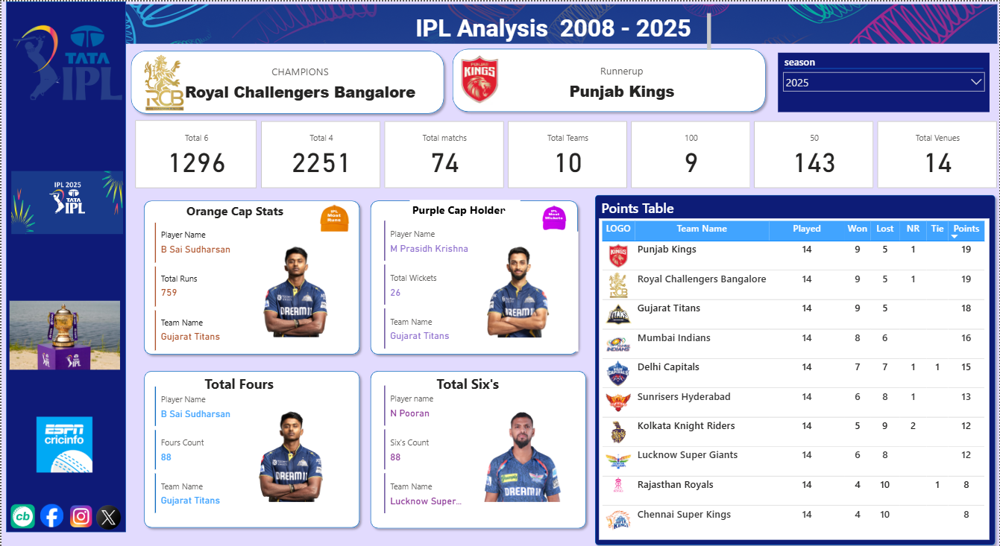

# IPL Analysis in Power BI

An interactive **Power BI project** that analyzes Indian Premier League (IPL) data from **2008 to 2025**.  
The dashboard provides insights into team performance, player achievements, and season statistics.

---

## 📊 Dashboard Preview

*Dashboard Highlights: Champions, Orange & Purple Cap Holders, Total Runs, Sixes, Fours, and Points Table.*

---

## 🚀 Features

- **Champions & Runner-up** of each IPL season  
- **Orange Cap** (top run-scorer) and **Purple Cap** (top wicket-taker)  
- **Season Stats**: Matches played, teams, venues, 4s, and 6s  
- **Points Table** with wins, losses, ties, and points  
- Interactive filters (by season, team, and player)  

---

## 📂 Repository Structure
- ipl_data/ # Raw and processed IPL match data (CSV files)
- ipl_images/ # Dashboard screenshots and assets
- ipl_data_analysis.pbix # Power BI report file

---

## 🛠 How to Use

1. Clone or download this repository.  
2. Open `ipl_data_analysis.pbix` in **Power BI Desktop**.  
3. If needed, update dataset paths (to match your local system).  
4. Use slicers/filters to explore IPL stats across seasons.  

---

## 📈 Insights from Dashboard

- **2025 Season Champions**: Royal Challengers Bangalore 🏆  
- **Runner-up**: Punjab Kings  
- **Orange Cap**: B Sai Sudharsan (759 runs)  
- **Purple Cap**: M Prasidh Krishna (26 wickets)  
- **Most Sixes**: N Pooran (88 sixes)  
- **Most Fours**: B Sai Sudharsan (88 fours)  

---

## ⚙️ Tools & Technologies
- **Power BI Desktop**  
- Data source: IPL datasets (2008–2025)  
- Visuals: Cards, Tables, and Custom Images  

---
